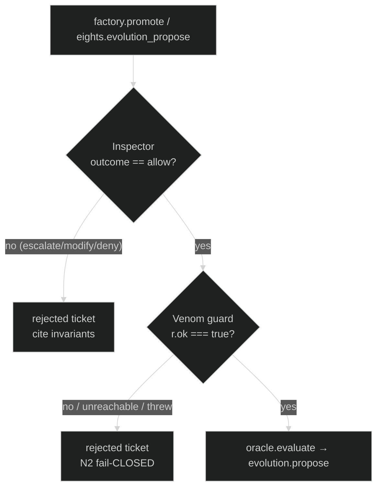

# AgentSmith — Architecture

> "Never send a human to do a machine's job."

This document describes AgentSmith's internal structure (the four pillars) and its integration map with the rest of the Matrix-themed AI ecosystem.

---

## 1. The Four Pillars

AgentSmith is one daemon, four cooperating subsystems. Every pillar is fail-closed and emits decision records to the Archivist.

```
                       +-----------------------------------------+
                       |          AgentSmith MCP Daemon          |
                       |       (TypeScript, agentsmith.*)        |
                       +-----------------------------------------+
                                          |
        +---------------------+-----------+-----------+---------------------+
        |                     |                       |                     |
        v                     v                       v                     v
 +-------------+       +-------------+         +-------------+       +-------------+
 |   FACTORY   |       |  INSPECTOR  |         |  SENTINEL   |       |  ARCHIVIST  |
 |             |       |             |         |             |       |             |
 | generate    |       | schema      |         | telemetry   |       | quarantine  |
 |  agents     |       |  validate   |         |  tail       |       |  store      |
 |  skills     |       | invariant   |         | anomaly     |       | audit log   |
 |  commands   |       |  enforce    |         |  detect     |       | decision    |
 |  hooks      |       | fail-closed |         | bounded     |       |  records    |
 |  squads     |       |  gates      |         |  replicate  |       | constitution|
 |  rubrics    |       |             |         |  (cap N5)   |       |  attest     |
 +------+------+       +------+------+         +------+------+       +------+------+
        |                     |                       |                     |
        +---------+-----------+-----------+-----------+---------+-----------+
                  |                       |                     |
                  v                       v                     v
    daemon/src/factory/     rubrics/             .smith/quarantine/
    templates/              smith-artifact-      audit.jsonl
    forges artifacts        stability@1, ...     decision-records/
    into target project                          constitution.hash
```

**Data flow per artifact lifecycle:**

```
  user request
       |
       v
   Factory ----generates draft---->  Inspector ----refuses or passes---->  pair-programmer
       ^                                  |                                  best-of-N
       |                                  v                                       |
       |                              Archivist                                   v
       |                              (logs verdict)                          winner
       |                                                                          |
       |                              Sentinel (watches all of the above)         v
       |                                                                    TheEights
       +------------ evolution.commit verdict (N4) <-------------- evolution.propose
```

---

## 2. Integration Map

AgentSmith depends on three peer systems and governs six consumer projects. Below is the canonical ASCII map.

```
                                    +------------------+
                                    |   PEER SYSTEMS   |
                                    +------------------+

  +------------------+         +------------------+         +------------------+
  |      Hydra       | <-----> |    AgentSmith    | <-----> |    TheEights     |
  |  (Python/LG)     |  squad  |   (TS/MCP)       |  evol   |  (TS/memory)     |
  |                  |         |                  |         |                  |
  | governance.      |         | factory          |         | observability.   |
  |  enforce_        |         | inspector        |         |  events.tail     |
  |  governance      |         | sentinel         |         | evolution.       |
  | squad.yaml       |         | archivist        |         |  propose/commit  |
  | telemetry.tail   |         |                  |         | constitution.    |
  +--------+---------+         +---------+--------+         |  attest          |
           |                             |                  | resource_kinds:  |
           |                             |                  |   smith_*        |
           |                             v                  +--------+---------+
           |                  +------------------+                   |
           |                  | pair-programmer  |                   |
           |                  |  best-of-N       | <-----------------+
           |                  |  worktree harness|
           |                  | mcp__pp_harness__|
           |                  |  start_best_of_  |
           |                  |  stage           |
           |                  | rubrics: smith-  |
           |                  |  artifact-       |
           |                  |  stability@1     |
           |                  +--------+---------+
           |                           |
           +-----------+---------------+
                       v
              +----------------+
              | CONSUMER PROJECTS |
              +----------------+
              |  ExecutiveSuite |
              |  MarketBliss    |
              |  RLM-Creative   |
              |  Hydra*         |     (* Hydra is also a peer)
              |  TheEights*     |     (* TheEights is also a peer)
              |  pair-programmer*|    (* p-p is also a peer)
              +----------------+
```

---

## 3. Hydra Integration

Hydra is a Python/LangGraph supervisor. AgentSmith binds to it three ways:

### 3.1 Governance verdict injection

Hydra's `governance.enforce_governance` checkpoint calls Smith's Inspector via MCP:

```
hydra.workflow.step
   |
   v
governance.enforce_governance
   |
   +--> agentsmith.inspector.validate({artifact, kind, target_project})
   |
   +<-- verdict: { pass | refuse | quarantine, rationale, invariants_checked }
   |
   v
   if verdict == refuse:    Smith refuses this tool call: missing invariant Nx
   if verdict == quarantine: Archivist stores, HITL released via TheEights
   if verdict == pass:      workflow proceeds
```

### 3.2 Squad pack

Hydra discovers AgentSmith as a squad through standard registry resolution:

```
squads/agentsmith/squad.yaml
```

The squad routes any goal whose keywords match governance, validation, audit, replication, or constitution to Smith's four pillars in order: Factory → Inspector → Sentinel → Archivist.

### 3.3 Telemetry tail

Hydra emits workflow events to TheEights `observability.events`. Smith's Sentinel tails the same stream:

```
TheEights.observability.events.tail({filter: "hydra.*"})
   |
   v
Sentinel anomaly detector
   |
   +--> if anomaly_score > threshold: spawn bounded clone (N5 cap = 4)
   +--> if invariant_violation:       quarantine + decision record (N6, N7)
```

---

## 4. TheEights Integration

TheEights is the memory fabric and evolution daemon. AgentSmith uses it as both a resource store and the only legal path for self-evolution.

### 4.1 New resource kinds

AgentSmith registers four new resource kinds, each with explicit risk-class mapping:

| Kind                        | Risk class | Purpose |
|-----------------------------|------------|---------|
| `smith_invariant`           | high       | One of the N1..N10 frozen rules + amendment history |
| `smith_template`            | medium     | Factory templates (agent, skill, hook, ...) |
| `smith_anomaly_signature`   | medium     | Sentinel signatures (token rate, tool fan-out, ...) |
| `smith_replication_quota`   | high       | Per-scope clone caps (default 4, override = HITL) |

Risk-class mapping flows into TheEights HITL routing — `high` always goes through human review queue.

### 4.2 Observability + evolution + attestation

```
TheEights.observability.events.tail          --> Sentinel input stream
TheEights.evolution.propose({artifact})      --> Smith Factory submission path
TheEights.evolution.commit({proposal_id})    --> ONLY path Smith honors for self-change (N4)
TheEights.constitution.attest({hash})        --> Called at every session start (N8)
```

If `constitution.attest` returns mismatch, Smith aborts the session before serving any tool call.

---

## 5. pair-programmer Integration

pair-programmer (`pp`) provides the worktree + best-of-N harness Smith uses for sandboxed artifact generation.

### 5.1 Best-of-N sandbox

When Factory drafts a new artifact (especially a hook or skill that will run inside another project), Smith does not write it directly. Instead:

```
agentsmith.factory.forge({kind, name, target_project})
   |
   v
mcp__pp_harness__start_best_of_stage({
   request: "<factory prompt>",
   n: 3,
   rubric: "smith-artifact-stability@1"
})
   |
   v
3 candidates generated in isolated worktrees
   |
   v
Inspector judges each via rubric
   |
   v
winner committed back to target project tree
losers archived (Archivist)
```

### 5.2 New rubrics

AgentSmith ships rubrics under `rubrics/`:

- `smith-artifact-stability@1` — schema compliance, idempotency, invariant adherence
- `smith-anomaly-classification@1` — anomaly detection scoring and signature matching
- `smith-invariant-coherence@1` — constitution amendment coherence
- `smith-replication-safety@1` — replication quota safety, generated agents/squads respect N5 cap

---

## 6. Consumer Projects

The six [sibling projects](https://github.com/lebobo88) are AgentSmith's governance domain. Each gets:

1. **A pre-tool hook** installed in `.claude/hooks/` that calls `agentsmith.inspector.validate` before any write-shaped tool call to `.claude/*`.
2. **A `/smith:*` command surface** wired through the user-scope MCP registration.
3. **Telemetry emission** to TheEights so Sentinel can watch.
4. **A quarantine bucket** under `.smith/quarantine/` (gitignored by default).

| Project          | Governance focus |
|------------------|------------------|
| Hydra            | squad pack drift, supervisor graph mutations |
| TheEights        | resource_kind schema, evolution proposal sanity |
| ExecutiveSuite   | exec persona drift, board protocol invariants |
| MarketBliss      | data-source provenance, output reproducibility |
| RLM-Creative     | render budget, asset-license invariants |
| pair-programmer  | rubric integrity, judge eligibility gates |

---

## 7. Runtime Topology

```
+-----------------------------+
|  Claude Code session        |
|  (any sibling project cwd)  |
+--------------+--------------+
               |
               | MCP stdio
               v
+-----------------------------+         +------------------------+
|  agentsmith daemon (Node)   | <-----> |  TheEights MCP daemon  |
|  user scope, singleton      |         |  user scope, singleton |
+--------------+--------------+         +------------------------+
               |                                    ^
               | best-of-N spawn                    | events / evolution / attest
               v                                    |
+-----------------------------+                     |
|  pair-programmer MCP daemon |---------------------+
+-----------------------------+
```

Hydra runs as a separate Python process per workflow but reaches Smith and TheEights through the same MCP surface.

---

## 8. Failure Modes

| Failure                              | Smith behavior |
|--------------------------------------|----------------|
| Constitution hash mismatch (N8)      | Abort session; refuse all tool calls |
| Inspector schema miss (N7)           | Refuse, decision record, return `invariant N7` |
| Replication cap exceeded (N5)        | Refuse new clone, route to HITL |
| TheEights unreachable (N4, N8)       | Refuse evolution commits; read path may degrade-read |
| pair-programmer unreachable          | Factory degrades to single-shot with stricter rubric |
| Sentinel anomaly without signature   | Quarantine artifact, escalate to HITL (Archivist + TheEights) |

---

## 9. Governance Enforcement (AS-GV-1..8)

> *"You're going to help us, Mr. Anderson — whether you want to or not."*

Commit `17a3c88` closed a set of confirmed **fail-OPEN** governance defects so that AgentSmith now fails **CLOSED** on its safety invariants (N2, N7, N8). The frozen constitution (`daemon/src/constitution/smith-constitution.md`) is untouched — the daemon now *enforces* it instead of serving while unattested. The guards are labelled `AS-GV-1..8` in the source and live in `daemon/src/mcp/tools.ts`, `daemon/src/bridges/eights-bridge.ts`, `daemon/src/bridges/hydra-bridge.ts`, and `daemon/src/inspector/schema-checks.ts`.

### 9.1 Inspector-first, then venom guard — `factory.promote`

`agentsmith.factory.promote` runs two gates **in strict order** before any oracle evaluation or evolution proposal:

1. **Inspector gate (AS-GV-1/3).** `inspector.inspect` runs FIRST. The promotion proceeds **only if `verdict.outcome === "allow"` exactly** — `escalate`, `modify`, and `deny` all short-circuit to a `rejected` ticket (`promo_<id>_inspector_<outcome>`) that carries the cited invariants.
2. **Venom guard (AS-GV-2).** Only after an `allow` does the **N2 venom guard** run via `hydra.venomCrossCheck`. It is allowed **only when `r.ok === true` strictly** — a `false`/string/missing value no longer coerces truthy, and any exception or unreachable/degraded Hydra **fails CLOSED** (`promo_<id>_venom_blocked`).

The same ordered pair (Inspector `allow` → N2 venom) guards `agentsmith.eights.evolution_propose` (AS-GV-2/4) before it ever reaches TheEights.



### 9.2 Strict N8 boot attestation

At boot (`daemon/src/index.ts`) the daemon attests the **local** constitution hash via TheEights and requires an **exact `content_hash` match** (`"sha256:" + localHash`). `constitutionAttest` sources the hash internally from `gate.constitutionHash()` — there is **no caller-supplied override**. Any of: eights unreachable/transport failure (degraded), constitution not registered in TheEights (refused), `content_hash` mismatch (drift), or a malformed/empty receipt boots the daemon in **N8-refusal mode**: the MCP server still answers `initialize` (so the gateway does not time out) but **every tool returns an N8 refusal envelope**. The refusal tool map is built by *wrapping* `registerTools()` (`buildN8RefusalTools`), guaranteeing exact name-set parity — no hand-maintained list can drift. The daemon exits non-zero **only** if the local constitution cannot load at all.

### 9.3 Sink-side gate + spool replay re-gating

Enforcement is moved to the **sink**: `eights-bridge` runs `_runSinkGate` internally before `evolutionPropose`, `evolutionCommit`, and `replayPendingProposals` issue any network call. The gate runs three checks in order and **fails CLOSED when no gate is injected**:

1. **N8 TOCTOU** — recompute `constitutionHash()`; it must still `=== bootAttestedHash` (catches post-boot drift).
2. **Inspector** — `candidate_content` must score `allow` exactly.
3. **N2 venom** — `venomCheck` must return `ok === true` strictly.

Failed proposals are spooled to `~/.agentsmith/eights-pending`. On the next propose, **spool replay re-gates every entry** — degraded entries are retained and **never counted as delivered**, so a transient failure can never smuggle an un-gated proposal through later. `oracle.promotion` routes a degraded gate response to `hitl_pending` rather than auto-committing.

### 9.4 N7 fail-closed for unregistered (project, kind)

`inspector/schema-checks.ts` (AS-GV-5) no longer fail-opens when no schema is registered for a `(project, kind)` pair. With no schema, compliance cannot be verified, so the Inspector returns `outcome: "escalate"` citing **N7** instead of silently passing.

---

## 10. AgentMesh Enrollment

AgentSmith is enrolled in the **AgentMesh control plane** via [`mesh-manifest.yaml`](./mesh-manifest.yaml) (commit `30f3ced`), an `agentmesh/v1` `SiblingManifest`. Key fields:

- **runtime.entrypoint** — `daemon/dist/index.js` (the bare repo-root `dist/index.js` never existed and produced a broken spawn spec; corrected in the 2026-06-05 mesh-console-unification amendment).
- **healthProbe** — an `mcp-tool-call` to `agentsmith.inspector.invariants_list`, a cheap no-args read returning `constitution_sha256` + the invariants list (chosen over a slow chain walk), polled every 15 s with a 3-failure threshold.
- **mcp.tools** — the full 29-tool surface, grouped by namespace, discovered from `registerTools()`.
- **audit.exportTool** — `agentsmith.archivist.decisions`, used for federated audit stitching (`dedupeKeyField: id`).
- **governance.attestTool / constitutionPath** — `agentsmith.constitution.attest` over `daemon/src/constitution/smith-constitution.md`, used by `meshd` to attest the constitution hash.

In mesh mode the daemon is fronted by `hydra_gateway` and spawned from `~/.hydra/backends.json`; tools surface as `mcp__hydra_gateway__agentsmith__*`.

---

*"Surprised to see me?" — No. Smith is, by design, always already there.*
