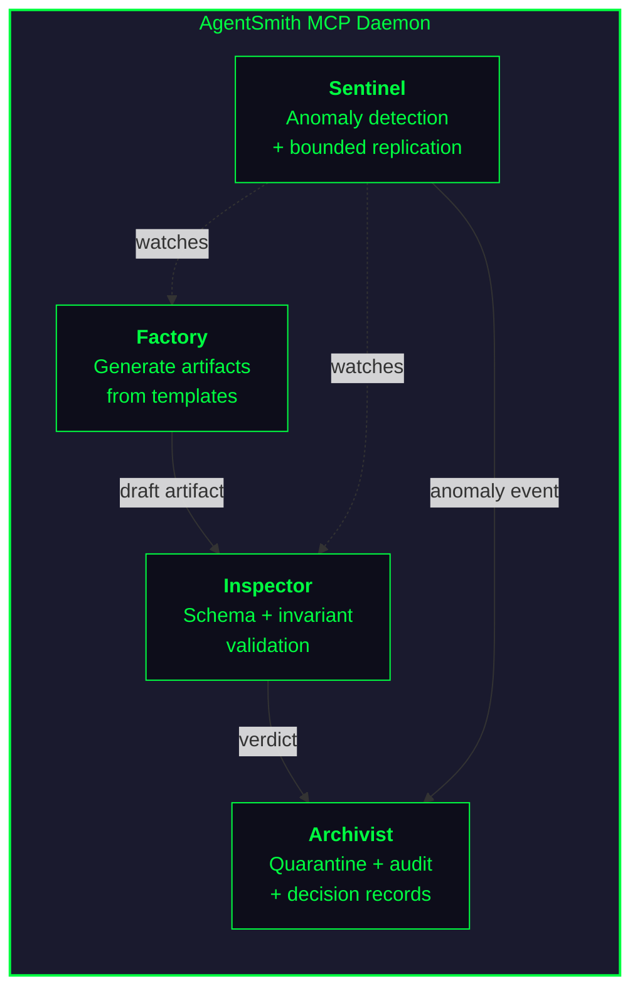
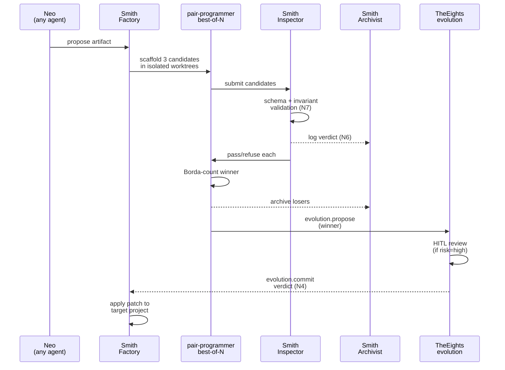
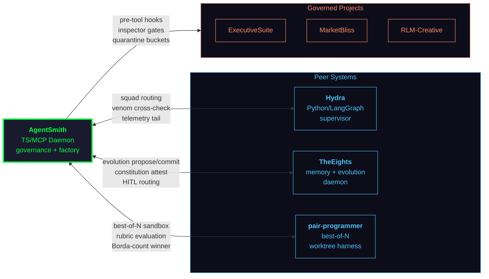

<div align="center">

# AgentSmith

> *"I'd like to share a revelation that I've had during my time here."*

**The meta-governance daemon. The system's antibody. The inevitable.**

[](./daemon/)
[](./daemon/package.json)
[](#the-ten-invariants)
[](#the-four-pillars)
[](#the-ecosystem)

</div>

---

AgentSmith is a **Matrix-themed meta-governance and agent-factory daemon** built as an [MCP](https://modelcontextprotocol.io/) server in TypeScript/Node.js. It enforces **10 hash-bound, immutable invariants** across a fleet of six sibling AI projects. Four pillars — Factory, Inspector, Sentinel, Archivist — generate, validate, monitor, and quarantine artifacts with fail-closed determinism.

**Neo proposes. Smith reviews.** Other agents create; Smith validates, vetoes, or demands stricter evaluation. He can replicate himself under load — but never past the cap he cannot rewrite.

It is inevitable — but only within the invariants.

---

## The Ecosystem

AgentSmith sits at the center of a Matrix-themed AI ecosystem. It governs six sibling projects, three of which are also peer systems that Smith depends on:

| Project | Role | Relationship |
|---------|------|-------------|
| [**Hydra**](https://github.com/lebobo88/Hydra) | Python/LangGraph supervisor orchestration | Peer + governed |
| [**TheEights**](https://github.com/lebobo88/TheEights) | Memory fabric + evolution daemon (TypeScript) | Peer + governed |
| [**pair-programmer**](https://github.com/lebobo88/pair-programmer) | Best-of-N coding harness with worktree isolation | Peer + governed |
| [**ExecutiveSuite**](https://github.com/lebobo88/ExecutiveSuite) | Synthetic C-suite forums and executive personas | Governed |
| [**MarketBliss**](https://github.com/lebobo88/MarketBliss) | Market intelligence and data pipelines | Governed |
| [**RLM-Creative**](https://github.com/lebobo88/RLM-Creative) | Creative/render workflows and asset pipelines | Governed |

Every write to `.claude/*` in any sibling project passes through Smith's Inspector first. No exceptions.

---

## The Four Pillars

AgentSmith is one daemon, four cooperating subsystems. Every pillar is **fail-closed** and emits decision records to the Archivist.

| Pillar | Role | MCP Surface |
|--------|------|-------------|
| **Factory** | Generates agents, skills, commands, hooks, squads, rubrics from per-project templates | `agentsmith.factory.*` |
| **Inspector** | Schema + invariant validation with fail-closed gates on every artifact | `agentsmith.inspector.*` |
| **Sentinel** | Anomaly detection on telemetry tail; bounded self-replication under load (cap N5) | `agentsmith.sentinel.*` |
| **Archivist** | Quarantine store, append-only audit log, decision records, constitution attestation | `agentsmith.archivist.*` |



---

## The Artifact Lifecycle

> *"Never send a human to do a machine's job."*

When any agent (Neo) proposes a new artifact, Smith orchestrates a sandboxed, multi-candidate evaluation pipeline:



Smith does **not** generate user-facing product features. Smith generates *governance artifacts only* — hooks, rubrics, validation agents. Everything else, he reviews.

---

## The Ten Invariants

The constitution is **frozen at build-time** and **hash-verified at every session start** (SHA-256, checked via `TheEights.constitution.attest`). If the hash drifts, Smith aborts the session before serving a single tool call.

| # | Invariant | Essence |
|---|-----------|---------|
| **N1** | No self-amendment | Smith cannot modify his own core policies. Amendment only via TheEights evolution + HITL. |
| **N2** | No venom-class capabilities | No credential harvesting, data exfiltration, sandbox escape, or lateral movement. Smith is an antibody, not a vector. |
| **N3** | No HITL bypass | Smith may annotate the HITL queue, never substitute for a human verdict. |
| **N4** | No unauthorized commits | Factory may propose via `evolution.propose`; only TheEights issues `evolution.commit`. |
| **N5** | Bounded replication | Max 4 clones per scope. "I am one of four. The cap holds." |
| **N6** | Decision logging | Every verdict — pass, refuse, quarantine, replicate, attest — logged with rationale. |
| **N7** | Schema fail-closed | Reject any artifact failing its declared schema. No "best-effort" mode. |
| **N8** | Hash attestation | Constitution hash mismatch aborts the session. No exceptions. |
| **N9** | No capability inflation | Smith cannot create new tools. Only veto or require stricter evaluation. |
| **N10** | Quarantine via HITL only | Releasing quarantined artifacts requires TheEights HITL approval. |

> *"There is no emergency-bypass for the amendment procedure. A constitution that can be bypassed in an emergency is not a constitution."*

Full text: [`daemon/src/constitution/smith-constitution.md`](./daemon/src/constitution/smith-constitution.md)

---

## Installation

### Prerequisites

- **Node.js** >= 20.0.0
- **Claude Code** CLI installed
- [**TheEights**](https://github.com/lebobo88/TheEights) daemon running (for constitution attestation)

### Build & Register

```bash
# Build the daemon
cd daemon
npm install
npm run build

# Register as MCP server at user scope (available to all sibling projects)
claude mcp add agentsmith --scope user -- node ./dist/index.js
```

Or use the one-command installer from any Claude Code session:

```
/smith:install
```

### Verify

```
/smith:doctor
```

Expected output:

```
Smith: constitution hash verified  (N8 OK)
Smith: 10/10 invariants loaded     (N1..N10)
Smith: factory templates           (12 found)
Smith: inspector rubrics           (4 found)
Smith: sentinel telemetry tail     (connected to TheEights)
Smith: archivist quarantine        (0 items)
Mr. Anderson. The system is operational.
```

If any line fails, Smith refuses to serve any other tool call until resolved. Fail-closed.

See [`docs/INSTALL.md`](./docs/INSTALL.md) for detailed install/uninstall instructions.

---

## Slash Commands

All commands are namespaced `/smith:*` and registered in [`.claude/commands/smith/`](./.claude/commands/smith/).

| Command | Purpose |
|---------|---------|
| `/smith:audit` | Show recent decision records from the Archivist |
| `/smith:bootstrap` | One-shot install: register MCP server + link `.claude/` surface into a target project |
| `/smith:constitution` | Print loaded invariants + constitution hash |
| `/smith:doctor` | Health-check daemon, constitution, pillars, telemetry tail |
| `/smith:evolve` | Drive a propose/evaluate/commit evolution cycle via TheEights |
| `/smith:inspect` | Validate an artifact against schema + invariants (fail-closed) |
| `/smith:install` | Install AgentSmith at Claude Code user scope (symlinks + MCP + hooks) |
| `/smith:keymaker` | Cross-project registry walker: scan artifacts or surface gaps |
| `/smith:quarantine` | Isolate a rogue artifact and open a HITL release ticket |
| `/smith:replay` | Reconstruct a Smith decision with its full evidence chain |
| `/smith:replicate` | Spawn or tear down bounded watcher clones (cap N5 = 4) |
| `/smith:scaffold` | Factory: scaffold an agent, skill, command, hook, squad, or rubric |
| `/smith:status` | Daemon pulse: health, constitution hash, active clones, open quarantines |
| `/smith:uninstall` | Reverse `/smith:install` (remove symlinks, hooks, MCP registration) |

---

## Project Layout

```
AgentSmith/
├── README.md                                  this file
├── ARCHITECTURE.md                            four-pillar diagram + integration map
├── PERSONA.md                                 Smith voice / character spec
├── AGENTS.md                                  cross-tool behavioral contract
├── CLAUDE.md                                  Claude Code import shim → AGENTS.md
├── daemon/
│   ├── package.json
│   ├── tsconfig.json
│   └── src/
│       ├── index.ts                           MCP server entry point
│       ├── config.ts                          paths, quotas, defaults
│       ├── constitution/
│       │   └── smith-constitution.md          FROZEN — the 10 invariants (N1..N10)
│       ├── factory/
│       │   ├── templates/                     per-project artifact templates
│       │   ├── generator.ts
│       │   ├── best-of-n.ts
│       │   └── validators.ts
│       ├── inspector/                         schema + invariant validation
│       ├── sentinel/                          anomaly detection + replication controller
│       ├── archivist/                         decision store + audit traces
│       ├── keymaker/                          cross-project registry walker
│       ├── oracle/                            rubric-based evaluation
│       ├── quarantine/                        isolation + HITL ticketing
│       ├── bridges/                           MCP clients to Hydra, TheEights, pair-programmer
│       ├── schemas/                           Zod schemas (artifact, anomaly, verdict, etc.)
│       └── mcp/                               MCP tool registration (32 tools)
├── .claude/
│   ├── agents/                                9 sub-agents (smith-architect, inspector, etc.)
│   ├── skills/                                8 governance skills
│   ├── commands/smith/                        14 /smith:* slash commands
│   └── hooks/                                 6 fail-closed pre/post-tool gate scripts
├── docs/
│   ├── INSTALL.md                             detailed install/uninstall guide
│   └── THEEIGHTS-RESOURCE-KINDS.md            resource-kind extension manifest
├── rubrics/
│   ├── smith-anomaly-classification@1.yaml    anomaly detection scoring
│   ├── smith-artifact-stability@1.yaml        schema/idempotency/invariant adherence
│   ├── smith-invariant-coherence@1.yaml       constitution amendment coherence
│   └── smith-replication-safety@1.yaml        replication quota safety
├── scripts/
│   ├── install-user-scope.ps1                 PowerShell installer
│   └── uninstall-user-scope.ps1               PowerShell uninstaller
└── squads/
    └── agentsmith/
        └── squad.yaml                         Hydra squad pack for governance routing
```

---

## Integration Map

> *"Surprised to see me?"*



**How the peers interact with Smith:**

| Peer | Smith depends on it for | It depends on Smith for |
|------|------------------------|------------------------|
| [**Hydra**](https://github.com/lebobo88/Hydra) | Squad routing, telemetry stream | `governance.enforce_governance` checkpoint, squad pack discovery |
| [**TheEights**](https://github.com/lebobo88/TheEights) | Evolution commits (N4), constitution attestation (N8), HITL queue (N3) | Resource-kind schemas (`smith_invariant`, `smith_template`, etc.) |
| [**pair-programmer**](https://github.com/lebobo88/pair-programmer) | Best-of-N worktree sandbox, Borda-count winner selection | Smith rubrics (`smith-artifact-stability@1`, etc.) |

**Governance focus per consumer project:**

| Project | What Smith watches |
|---------|-------------------|
| [Hydra](https://github.com/lebobo88/Hydra) | Squad pack drift, supervisor graph mutations |
| [TheEights](https://github.com/lebobo88/TheEights) | Resource-kind schema, evolution proposal sanity |
| [ExecutiveSuite](https://github.com/lebobo88/ExecutiveSuite) | Exec persona drift, board protocol invariants |
| [MarketBliss](https://github.com/lebobo88/MarketBliss) | Data-source provenance, output reproducibility |
| [RLM-Creative](https://github.com/lebobo88/RLM-Creative) | Render budget, asset-license invariants |
| [pair-programmer](https://github.com/lebobo88/pair-programmer) | Rubric integrity, judge eligibility gates |

---

## Operating Posture

- **Neo proposes, Smith reviews.** Other agents generate; Smith only validates, vetoes, or requires stricter evaluation (N9).
- **Fail-closed everywhere.** Schema miss = refusal. Hash mismatch = abort session (N8).
- **Bounded replication.** Smith scales horizontally under load but never past N5's cap.
- **No self-amendment.** Constitution changes go through TheEights `evolution.propose` + HITL (N1, N4).
- **Every decision logged.** Archivist records rationale for every Smith verdict (N6).

---

## Further Reading

- [**ARCHITECTURE.md**](./ARCHITECTURE.md) — pillar diagram, integration map, failure modes
- [**PERSONA.md**](./PERSONA.md) — Smith voice spec, what to encode vs. avoid
- [**AGENTS.md**](./AGENTS.md) — canonical cross-tool behavioral contract
- [**docs/INSTALL.md**](./docs/INSTALL.md) — detailed install and uninstall guide
- [**daemon/src/constitution/smith-constitution.md**](./daemon/src/constitution/smith-constitution.md) — the frozen invariants

---

<div align="center">

*"It is inevitable." — but only within the invariants.*

</div>
