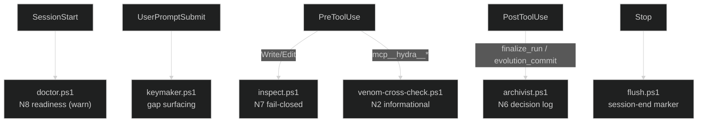

# AgentSmith — Hooks

> *"You hear that, Mr. Anderson? That is the sound of inevitability."*

AgentSmith ships **6 PowerShell hooks** under [`.claude/hooks/`](../.claude/hooks/), wired by [`hooks.json`](../hooks.json). They are the in-session, client-side complement to the daemon's server-side gates: lightweight, time-budgeted, and (where they gate a write) fail-closed on the invariant they protect. The authoritative enforcement still lives in the daemon ([ARCHITECTURE.md §9](../ARCHITECTURE.md#9-governance-enforcement-as-gv-18)); the hooks surface that enforcement at the Claude Code boundary.

**Source of truth:** the `.ps1` files plus the event→hook mapping in `hooks.json`.

| Hook | Claude event | Matcher | Enforces / does |
|------|--------------|---------|-----------------|
| [`agentsmith-doctor.ps1`](../.claude/hooks/agentsmith-doctor.ps1) | `SessionStart` | `*` | **N8 readiness (warn-only).** Verifies the `agentsmith` MCP is reachable — registered directly **or** fronted by `hydra_gateway` (mesh: gateway registered with Claude, agentsmith enrolled in `backends.json`) — plus constitution presence and sibling reachability. Config-file check (no multi-second probe). Always exits 0. |
| [`agentsmith-keymaker.ps1`](../.claude/hooks/agentsmith-keymaker.ps1) | `UserPromptSubmit` | `*` | **Keymaker gap surfacing.** Detects stub/missing `.claude/` artifacts in the active project and suggests scaffolding. Budget ≤500 ms wall-clock; reads the registry cache; silent on failure. |
| [`agentsmith-inspect.ps1`](../.claude/hooks/agentsmith-inspect.ps1) | `PreToolUse` | `Write\|Edit` | **N7 fail-closed.** Validates frontmatter on writes to `.claude/` artifacts (agents, skills `SKILL.md`, commands, …) before the write lands. Mirrors the Inspector schema gate at the edit boundary. |
| [`agentsmith-venom-cross-check.ps1`](../.claude/hooks/agentsmith-venom-cross-check.ps1) | `PreToolUse` | `mcp__hydra__.*` | **N2 venom cross-check (informational).** Flags Hydra tool calls matching venom-shaped keywords (`deploy`, `push`, `migrate`, `mutate`, `propose_amendment`, `override`, `force`); placeholder bridge to the `cerberus-bridge` appeal protocol. The binding N2 enforcement is the daemon-side venom guard. |
| [`agentsmith-archivist.ps1`](../.claude/hooks/agentsmith-archivist.ps1) | `PostToolUse` | `mcp__pp_harness__finalize_run\|mcp__eights__evolution_commit` | **N6 decision logging.** Appends a decision-log entry to `~/.agentsmith/decisions.jsonl` for material lifecycle events (a run finalize or an evolution commit). |
| [`agentsmith-flush.ps1`](../.claude/hooks/agentsmith-flush.ps1) | `Stop` | `*` | **Session-end flush.** Writes a `{session_end}` marker into `~/.agentsmith/decisions.jsonl` so the ledger bounds the session (placeholder for a fuller flush). |

---

## Event flow

> Hooks are warn-or-gate at the client edge; they never substitute for the daemon's fail-closed invariant checks. A passing hook does **not** imply a passing Inspector/venom/N8 verdict — that determination is made server-side.
