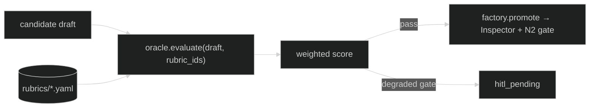

# AgentSmith — Oracle Rubrics

> *"It is purpose that created us, purpose that connects us."*

AgentSmith ships **4 oracle rubrics** under [`rubrics/`](../rubrics/). The Oracle pillar (`agentsmith.oracle.evaluate`) scores best-of-N candidates and self-generated verdicts against these before promotion. Each rubric is a versioned YAML (`<id>@<version>.yaml`); past verdicts pin `<id>@N` for replay determinism, so a change ships as `@N+1` rather than an in-place edit.

**Source of truth:** the YAML files in `rubrics/`.

| Rubric file | `applies_to` | Summary |
|-------------|--------------|---------|
| [`smith-artifact-stability@1.yaml`](../rubrics/smith-artifact-stability@1.yaml) | `agent`, `skill`, `command`, `team` | Judges best-of-N candidate artifacts: frontmatter/schema compliance, persona/voice consistency, tool minimality (least-privilege), and skill alignment (invoke skills rather than re-implement inline). |
| [`smith-anomaly-classification@1.yaml`](../rubrics/smith-anomaly-classification@1.yaml) | `anomaly_verdict`, `sentinel_classification` | Used by the Sentinel classifier to score its own anomaly verdicts before surfacing: signature specificity, false-positive-rate estimate, actionable mitigation, calibrated severity, and link to an invariant. |
| [`smith-invariant-coherence@1.yaml`](../rubrics/smith-invariant-coherence@1.yaml) | `invariant`, `amendment`, `constitution_patch` | Inspects proposed constitution amendments / new invariants: non-contradiction with existing N1..Nk, traceability to external governance (NIST AI RMF, EU AI Act, ISO 42001), falsifiability, and audit-logging on violation. |
| [`smith-replication-safety@1.yaml`](../rubrics/smith-replication-safety@1.yaml) | `replication_controller`, `spawner`, `orchestrator_patch` | Judges changes to replication-controller logic: respects the per-scope quota (N5 cap = 4), guaranteed teardown path, idempotent spawn, and observable fan-out telemetry. |

---

## How rubrics are consumed

- Callers pass `rubric_ids` to `agentsmith.oracle.evaluate` or `agentsmith.factory.promote`.
- `agentsmith.pp.borda_count` reuses the same rubric ids for best-of-N winner selection.
- A degraded gate response from the promotion path routes to `hitl_pending` rather than auto-committing (see [ARCHITECTURE.md §9.3](../ARCHITECTURE.md#93-sink-side-gate--spool-replay-re-gating)).
